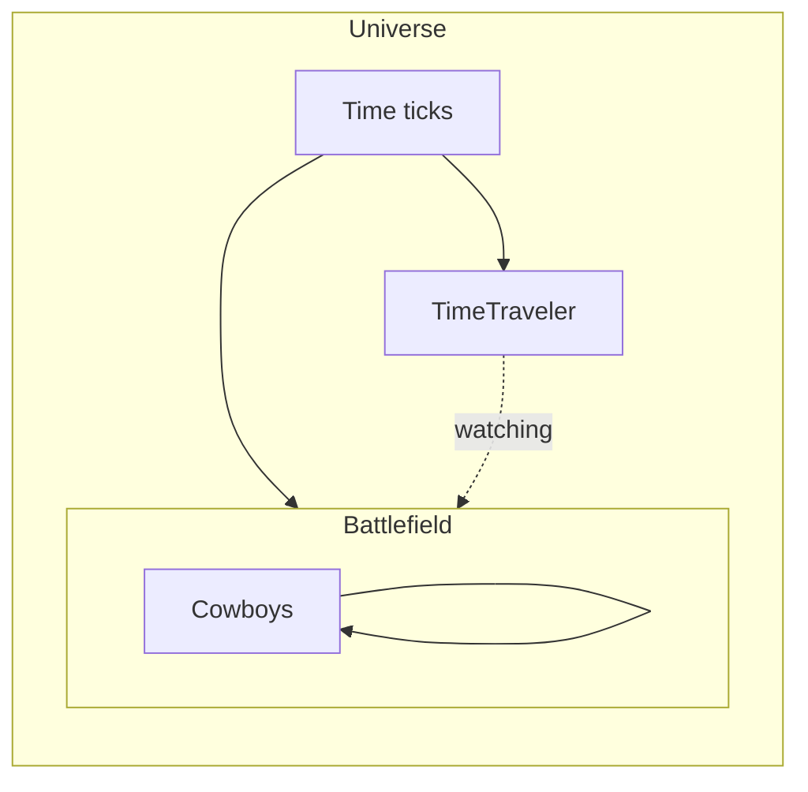
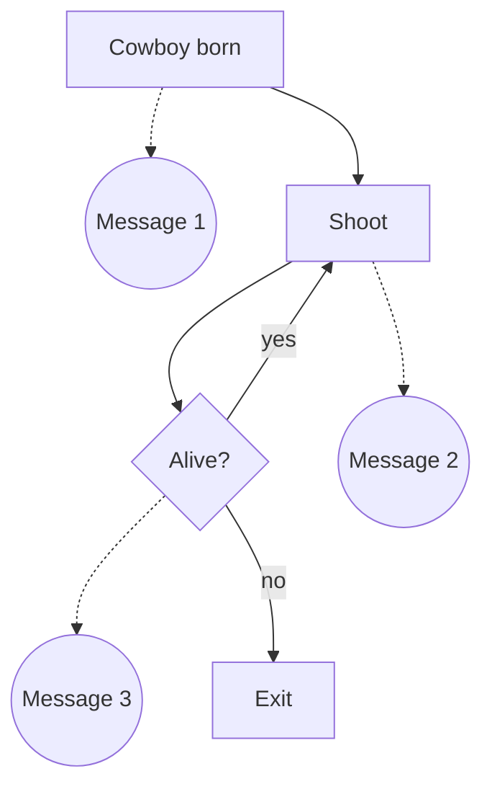

# Cowboys problem

We have a group of cowboys and only one can leave the battlefield alive.



They meet at the battlefield and prepare to fight. They live in a universe that has Time property which provides fourth dimension for their actions. Because this is a historic battle a time traveler decided to join the battlefield hidden behind a pale of wood and watch the fight til its end to record information about this glorious battle that changed course of cowboys' history for thousands of ticks.

Cowboys have solid codex they are bind to follow.



The codex is same for all of them but not all of them have the same properties. Some brought bigger gun, some can withstand severe damage. But there is also luck which is simply hidden inside implementation of their universe.

Cowboys live in the universe that provides time and also expect five cowboys exists live or dead inside it. When universe is born it checks if all of this properties are correct and starts ticking.

When all five cowboys are dead universe collapses into it self which kills even our time traveler.


## Debug

Subscribe to the nats communication

    nats sub ">"

Publish a message to the battlefield:

    nats pub --count 1 battlefield -w '{"type": "tick", "number": 1}'

## Quick start

Three services:

* universe - synchronization of the cowboys
* cowboy - implementation of a single cowboy
* timetraveler - logs everything what happens, record of the battle is going to be in his stdout (make sure this one runs before everything else starts)

All three services are configurable but the most important is output of *timetraveler* that logs progress of the battle.

To boot up everything do this:

```shell
docker-compose up -d
docker-compose logs -f timetraveler
```

The *timetraveler* log contains all info about the battle. When the battle finishes only *nats* service suppose to be up. All other containers will stop.

To check if the code should be ok run this:

```shell
make test
```

To build a new docker image run this:

```shell
make image
```

## Things I would finish if I had more time

Originally I wanted cowboys to check readiness of their enemies and let the synchronization up to them. It would add a layer or randomness
to the loop but same time it would take me some extra time I don't have now. So I decided to use simpler solution where Universe checks if
all cowboys are ready.

I used opportunistic testing in some cases. That part requires a little bit more love because it makes
the tests less deterministic and slower. Good enough for this case I guess.

Tests can "freeze" testing process if there is a bug in the code.

Missing tests for main functions.

Missing test for message handler in TimeTraveler. I use simple log.Printf() and log.Println() and it would require a little bit more abstraction to be more user friendly.

There will be some race conditions hidden. I haven't had enough time to think it through so it's probably possible to break the parts with unexpected inputs and crashes.
